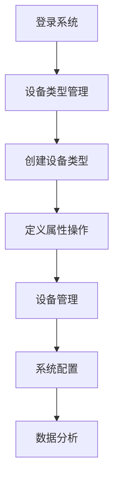
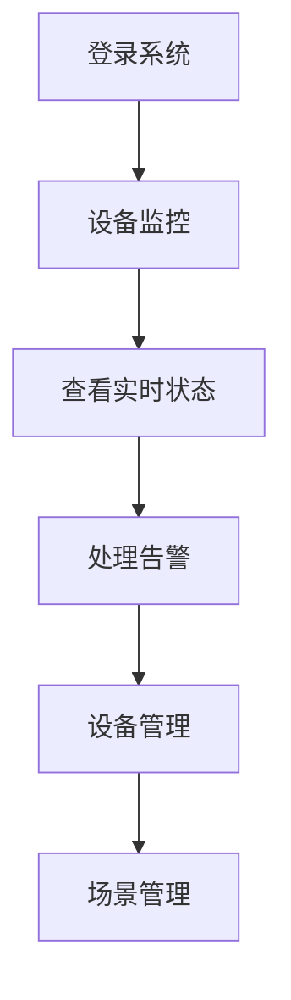

# 曦源IoT低代码平台前端功能完善需求文档

## 1. 产品概述

曦源IoT低代码平台是一个面向教学楼的物联网设备管理和场景编排平台。当前前端已实现基础的设备管理、场景管理和仪表板功能，但缺少核心的设备类型管理、实时监控、系统配置等关键功能。本文档旨在完善前端功能，充分发挥平台的低代码特性和管理能力。

## 2. 核心特性

### 2.1 用户角色
| 角色 | 注册方法 | 核心权限 |
|------|----------|----------|
| 系统管理员 | 默认账户 | 可管理设备类型、系统配置、查看所有数据 |
| 设备管理员 | 管理员创建 | 可管理设备、场景，查看监控数据 |
| 普通用户 | 邀请注册 | 可查看设备状态、执行场景 |

### 2.2 功能模块

本次完善主要包含以下页面：

1. **设备类型管理页面**：设备类型元模型管理，属性、操作、事件定义
2. **设备监控页面**：实时状态监控，历史数据图表，告警管理
3. **系统配置页面**：MQTT配置，系统参数，用户管理
4. **数据分析页面**：设备数据统计，场景执行分析，使用报表
5. **设备模拟器管理页面**：模拟器状态监控，配置管理
6. **组件库**：可复用的设备状态、图表、编辑器组件

### 2.3 页面详情

| 页面名称 | 模块名称 | 功能描述 |
|----------|----------|----------|
| 设备类型管理 | 类型列表 | 显示所有设备类型，支持搜索筛选 |
| 设备类型管理 | 类型编辑器 | 可视化编辑设备属性、操作、事件定义 |
| 设备类型管理 | 类型预览 | 预览设备类型的完整模型结构 |
| 设备监控 | 实时状态 | 实时显示设备在线状态、数据更新 |
| 设备监控 | 历史数据 | 设备历史数据图表展示，支持时间范围选择 |
| 设备监控 | 告警中心 | 设备异常告警列表，告警规则配置 |
| 系统配置 | MQTT配置 | MQTT服务器连接配置，主题管理 |
| 系统配置 | 系统参数 | 平台基础参数配置，功能开关 |
| 系统配置 | 用户管理 | 用户账户管理，权限分配 |
| 数据分析 | 设备统计 | 设备使用情况统计图表 |
| 数据分析 | 场景分析 | 场景执行频率、成功率分析 |
| 数据分析 | 报表导出 | 数据报表生成和导出功能 |
| 模拟器管理 | 模拟器状态 | 显示模拟器运行状态，启停控制 |
| 模拟器管理 | 设备配置 | 配置模拟设备参数，添加删除模拟设备 |

## 3. 核心流程

### 管理员流程

### 设备管理员流程

## 4. 用户界面设计

### 4.1 设计风格
- 主色调：#409EFF (Element Plus 蓝色)，辅助色：#67C23A (成功绿)、#E6A23C (警告橙)、#F56C6C (危险红)
- 按钮风格：圆角按钮，支持多种尺寸
- 字体：系统默认字体栈，主要文字14px，标题16-24px
- 布局风格：卡片式布局，左侧导航，响应式设计
- 图标风格：Element Plus 图标库，简洁现代

### 4.2 页面设计概览

| 页面名称 | 模块名称 | UI元素 |
|----------|----------|---------|
| 设备类型管理 | 类型列表 | 表格展示，搜索框，操作按钮，分页器 |
| 设备类型管理 | 类型编辑器 | 表单组件，动态字段，拖拽排序，JSON编辑器 |
| 设备监控 | 实时状态 | 状态卡片，进度条，实时数据，WebSocket连接 |
| 设备监控 | 历史数据 | ECharts图表，时间选择器，数据筛选 |
| 系统配置 | 配置表单 | 分组表单，开关组件，验证提示 |
| 数据分析 | 统计图表 | 饼图、柱状图、折线图，数据表格 |

### 4.3 响应式设计
- 桌面优先设计，支持平板和手机适配
- 断点：768px (平板)，480px (手机)
- 移动端优化：侧边栏折叠，表格横向滚动，触摸友好的按钮尺寸