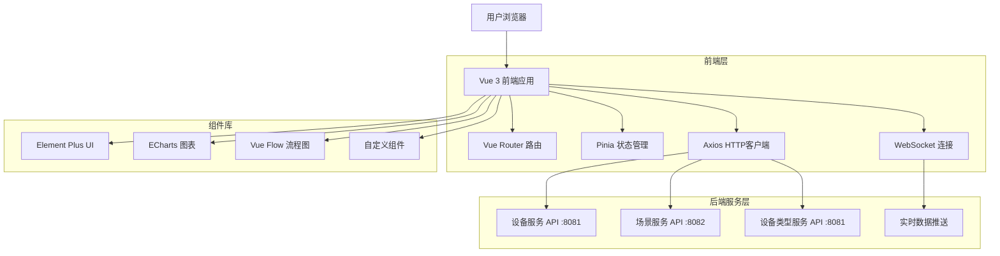
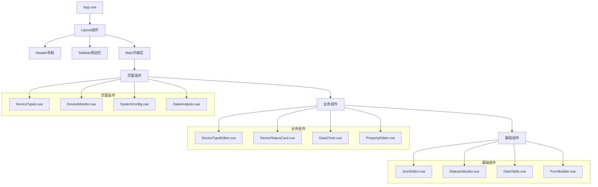
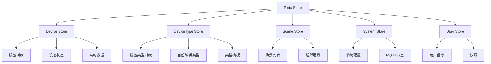
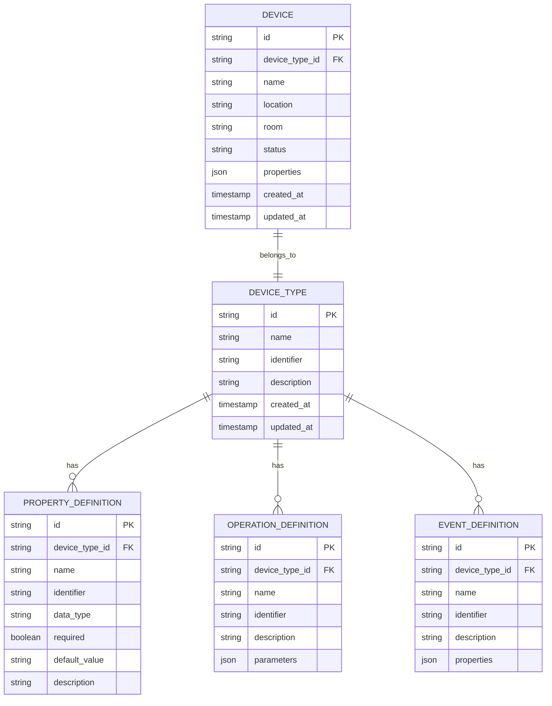

# 曦源IoT低代码平台前端技术架构文档

## 1. 架构设计



## 2. 技术描述

- 前端：Vue@3 + Element Plus@2 + Vue Router@4 + Pinia@2 + Axios@1 + ECharts@5 + Vue Flow@1
- 构建工具：Vite@4
- 样式：CSS3 + Element Plus主题
- 实时通信：WebSocket + MQTT over WebSocket

## 3. 路由定义

| 路由 | 用途 |
|------|------|
| /dashboard | 仪表板，显示系统概览和快速操作 |
| /devices | 设备管理，设备列表和操作 |
| /device-types | 设备类型管理，类型定义和编辑 |
| /device-monitor | 设备监控，实时状态和历史数据 |
| /scenes | 场景管理，场景列表和操作 |
| /scene-designer | 场景编排，可视化场景设计器 |
| /system-config | 系统配置，MQTT和系统参数配置 |
| /data-analysis | 数据分析，统计图表和报表 |
| /simulator-management | 模拟器管理，模拟器状态和配置 |
| /login | 登录页面，用户身份验证 |

## 4. API定义

### 4.1 设备类型管理API

获取设备类型列表
```
GET /api/device-types
```

Response:
| 参数名称 | 参数类型 | 描述 |
|----------|----------|------|
| id | string | 设备类型ID |
| name | string | 设备类型名称 |
| identifier | string | 设备类型标识符 |
| description | string | 描述 |
| properties | array | 属性定义列表 |
| operations | array | 操作定义列表 |
| events | array | 事件定义列表 |

创建设备类型
```
POST /api/device-types
```

Request:
| 参数名称 | 参数类型 | 是否必需 | 描述 |
|----------|----------|----------|------|
| name | string | true | 设备类型名称 |
| identifier | string | true | 设备类型标识符 |
| description | string | false | 描述 |
| properties | array | false | 属性定义列表 |
| operations | array | false | 操作定义列表 |
| events | array | false | 事件定义列表 |

### 4.2 设备监控API

获取设备实时状态
```
GET /api/devices/{deviceId}/state
```

获取设备历史数据
```
GET /api/devices/{deviceId}/history?startTime={start}&endTime={end}
```

### 4.3 WebSocket API

实时数据推送
```
WebSocket: ws://localhost:8080/ws/device-data
```

消息格式:
```json
{
  "type": "device_state_update",
  "deviceId": "device_001",
  "timestamp": "2024-01-01T00:00:00Z",
  "data": {
    "temperature": 25.5,
    "humidity": 60.2,
    "status": "online"
  }
}
```

## 5. 组件架构

### 5.1 组件层次结构



### 5.2 状态管理



## 6. 数据模型

### 6.1 设备类型模型



### 6.2 前端数据结构

设备类型TypeScript接口定义：

```typescript
interface DeviceType {
  id: string;
  name: string;
  identifier: string;
  description?: string;
  properties: PropertyDefinition[];
  operations: OperationDefinition[];
  events: EventDefinition[];
  createdAt: string;
  updatedAt: string;
}

interface PropertyDefinition {
  id: string;
  name: string;
  identifier: string;
  dataType: 'string' | 'number' | 'boolean' | 'object';
  required: boolean;
  defaultValue?: any;
  description?: string;
}

interface OperationDefinition {
  id: string;
  name: string;
  identifier: string;
  description?: string;
  parameters: ParameterDefinition[];
}

interface EventDefinition {
  id: string;
  name: string;
  identifier: string;
  description?: string;
  properties: PropertyDefinition[];
}

interface ParameterDefinition {
  name: string;
  dataType: string;
  required: boolean;
  description?: string;
}
```