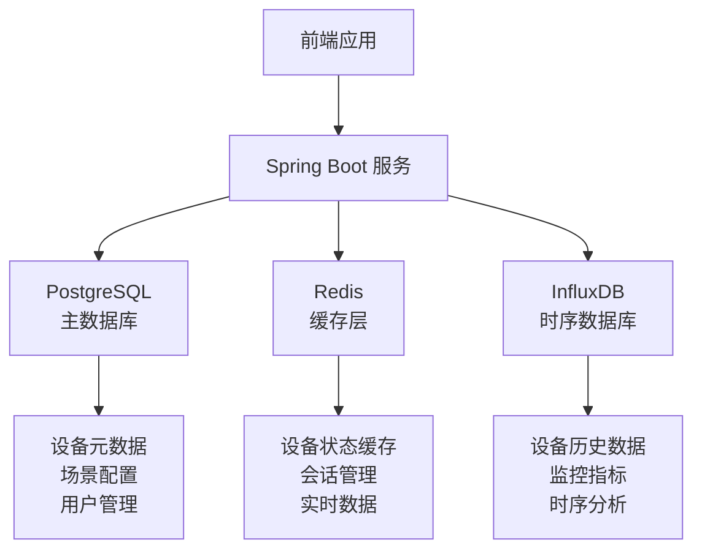

# 数据库升级方案文档

## 1. 当前数据库方案分析

### 1.1 现状概述
您的项目目前使用 **H2 内存数据库** 作为主要存储方案：

- **设备服务**: `jdbc:h2:mem:devicedb`
- **场景服务**: `jdbc:h2:mem:scenedb`
- **配置**: 内存模式，数据不持久化

### 1.2 H2数据库的问题分析

#### ❌ 主要问题
1. **数据丢失风险**
   - 服务重启后所有数据丢失
   - 无法进行数据备份和恢复
   - 不适合生产环境使用

2. **性能限制**
   - 内存容量限制数据量
   - 无法处理大规模IoT设备数据
   - 缺乏高并发支持

3. **功能局限**
   - 不支持复杂查询优化
   - 缺乏时序数据处理能力
   - 无法实现数据分片和集群

4. **运维困难**
   - 无法监控数据库性能
   - 缺乏备份恢复机制
   - 难以进行数据分析

## 2. 推荐方案：PostgreSQL + Redis + InfluxDB

### 2.1 方案架构



### 2.2 各组件职责

#### 🐘 PostgreSQL (主数据库)
- **用途**: 存储结构化业务数据
- **数据类型**:
  - 设备类型定义和元数据
  - 设备基本信息和配置
  - 场景规则和配置
  - 用户账户和权限
  - 系统配置信息

#### 🔴 Redis (缓存和实时数据)
- **用途**: 高速缓存和实时数据处理
- **数据类型**:
  - 设备实时状态缓存
  - 用户会话信息
  - 频繁查询结果缓存
  - 消息队列和发布订阅

#### 📊 InfluxDB (时序数据库)
- **用途**: 专门处理时间序列数据
- **数据类型**:
  - 设备传感器历史数据
  - 系统性能监控指标
  - 设备运行状态历史
  - 数据分析和报表

### 2.3 为什么这个组合适合IoT平台

#### 🎯 IoT平台特点匹配
1. **海量时序数据**: InfluxDB专门优化时序数据存储和查询
2. **实时性要求**: Redis提供毫秒级数据访问
3. **复杂业务逻辑**: PostgreSQL支持复杂关系和事务
4. **高并发访问**: 三层架构分散负载压力

#### 📈 性能优势
- **查询性能**: 各数据库针对特定场景优化
- **存储效率**: 时序数据压缩比可达90%
- **并发能力**: 支持数千设备同时连接
- **扩展性**: 支持水平扩展和集群部署

## 3. 数据迁移步骤

### 3.1 迁移准备阶段

#### Step 1: 备份现有数据结构
```bash
# 导出H2数据库结构
java -cp h2*.jar org.h2.tools.Script -url jdbc:h2:mem:devicedb -script backup.sql
```

#### Step 2: 分析数据模型
- 识别核心业务实体
- 区分实时数据和历史数据
- 设计数据分层存储策略

### 3.2 数据库设计阶段

#### Step 3: PostgreSQL 表结构设计
```sql
-- 设备类型表
CREATE TABLE device_types (
    id BIGSERIAL PRIMARY KEY,
    type_identifier VARCHAR(100) UNIQUE NOT NULL,
    name VARCHAR(200) NOT NULL,
    description TEXT,
    category VARCHAR(100),
    created_at TIMESTAMP DEFAULT CURRENT_TIMESTAMP,
    updated_at TIMESTAMP DEFAULT CURRENT_TIMESTAMP
);

-- 设备表
CREATE TABLE devices (
    id BIGSERIAL PRIMARY KEY,
    device_id VARCHAR(100) UNIQUE NOT NULL,
    name VARCHAR(200) NOT NULL,
    type_id BIGINT REFERENCES device_types(id),
    location VARCHAR(200),
    status VARCHAR(50) DEFAULT 'OFFLINE',
    created_at TIMESTAMP DEFAULT CURRENT_TIMESTAMP,
    updated_at TIMESTAMP DEFAULT CURRENT_TIMESTAMP
);

-- 场景表
CREATE TABLE scenes (
    id BIGSERIAL PRIMARY KEY,
    scene_id VARCHAR(100) UNIQUE NOT NULL,
    name VARCHAR(200) NOT NULL,
    description TEXT,
    status VARCHAR(50) DEFAULT 'INACTIVE',
    created_at TIMESTAMP DEFAULT CURRENT_TIMESTAMP,
    updated_at TIMESTAMP DEFAULT CURRENT_TIMESTAMP
);
```

#### Step 4: InfluxDB 数据结构设计
```sql
-- 设备数据测量
CREATE MEASUREMENT device_data (
    time TIMESTAMP,
    device_id TAG,
    property_name TAG,
    value FIELD,
    unit TAG
);

-- 系统监控测量
CREATE MEASUREMENT system_metrics (
    time TIMESTAMP,
    service_name TAG,
    metric_type TAG,
    value FIELD
);
```

### 3.3 实施迁移阶段

#### Step 5: 渐进式迁移
1. **阶段1**: 部署新数据库环境
2. **阶段2**: 双写模式（同时写入H2和新数据库）
3. **阶段3**: 数据验证和一致性检查
4. **阶段4**: 切换读取到新数据库
5. **阶段5**: 停止H2数据库

## 4. Docker Compose配置更新

### 4.1 新增数据库服务

```yaml
version: '3.8'

services:
  # PostgreSQL 主数据库
  postgres:
    image: postgres:15-alpine
    container_name: postgres-db
    environment:
      POSTGRES_DB: iot_platform
      POSTGRES_USER: iot_user
      POSTGRES_PASSWORD: iot_password
    ports:
      - "5432:5432"
    volumes:
      - postgres_data:/var/lib/postgresql/data
      - ./scripts/init-db.sql:/docker-entrypoint-initdb.d/init-db.sql
    networks:
      - iot-network
    restart: unless-stopped

  # Redis 缓存
  redis:
    image: redis:7-alpine
    container_name: redis-cache
    ports:
      - "6379:6379"
    volumes:
      - redis_data:/data
    networks:
      - iot-network
    restart: unless-stopped
    command: redis-server --appendonly yes

  # InfluxDB 时序数据库
  influxdb:
    image: influxdb:2.7-alpine
    container_name: influxdb-timeseries
    environment:
      DOCKER_INFLUXDB_INIT_MODE: setup
      DOCKER_INFLUXDB_INIT_USERNAME: admin
      DOCKER_INFLUXDB_INIT_PASSWORD: adminpassword
      DOCKER_INFLUXDB_INIT_ORG: iot-platform
      DOCKER_INFLUXDB_INIT_BUCKET: device-data
    ports:
      - "8086:8086"
    volumes:
      - influxdb_data:/var/lib/influxdb2
    networks:
      - iot-network
    restart: unless-stopped

  # 现有服务更新...
  device-service:
    build: 
      context: ./backend/device-service
      dockerfile: Dockerfile
    ports:
      - "8081:8081"
    environment:
      - SPRING_PROFILES_ACTIVE=prod
      - DB_HOST=postgres
      - DB_PORT=5432
      - DB_NAME=iot_platform
      - DB_USER=iot_user
      - DB_PASSWORD=iot_password
      - REDIS_HOST=redis
      - REDIS_PORT=6379
      - INFLUXDB_URL=http://influxdb:8086
      - MQTT_BROKER_URL=tcp://mosquitto:1883
    depends_on:
      - postgres
      - redis
      - influxdb
      - mosquitto
    networks:
      - iot-network
    restart: unless-stopped

volumes:
  postgres_data:
  redis_data:
  influxdb_data:

networks:
  iot-network:
    driver: bridge
```

## 5. Spring Boot配置修改

### 5.1 依赖更新 (pom.xml)

```xml
<dependencies>
    <!-- PostgreSQL -->
    <dependency>
        <groupId>org.postgresql</groupId>
        <artifactId>postgresql</artifactId>
        <scope>runtime</scope>
    </dependency>
    
    <!-- Redis -->
    <dependency>
        <groupId>org.springframework.boot</groupId>
        <artifactId>spring-boot-starter-data-redis</artifactId>
    </dependency>
    
    <!-- InfluxDB -->
    <dependency>
        <groupId>com.influxdb</groupId>
        <artifactId>influxdb-client-java</artifactId>
        <version>6.10.0</version>
    </dependency>
    
    <!-- 连接池 -->
    <dependency>
        <groupId>com.zaxxer</groupId>
        <artifactId>HikariCP</artifactId>
    </dependency>
</dependencies>
```

### 5.2 应用配置更新

#### application.yml
```yaml
spring:
  # PostgreSQL 配置
  datasource:
    url: jdbc:postgresql://${DB_HOST:localhost}:${DB_PORT:5432}/${DB_NAME:iot_platform}
    username: ${DB_USER:iot_user}
    password: ${DB_PASSWORD:iot_password}
    driver-class-name: org.postgresql.Driver
    hikari:
      maximum-pool-size: 20
      minimum-idle: 5
      connection-timeout: 30000
      idle-timeout: 600000
      max-lifetime: 1800000

  # JPA 配置
  jpa:
    hibernate:
      ddl-auto: validate
    show-sql: false
    properties:
      hibernate:
        dialect: org.hibernate.dialect.PostgreSQLDialect
        format_sql: true
        jdbc:
          batch_size: 20
        order_inserts: true
        order_updates: true

  # Redis 配置
  redis:
    host: ${REDIS_HOST:localhost}
    port: ${REDIS_PORT:6379}
    timeout: 2000ms
    lettuce:
      pool:
        max-active: 8
        max-idle: 8
        min-idle: 0

# InfluxDB 配置
influxdb:
  url: ${INFLUXDB_URL:http://localhost:8086}
  token: ${INFLUXDB_TOKEN:your-token}
  org: ${INFLUXDB_ORG:iot-platform}
  bucket: ${INFLUXDB_BUCKET:device-data}
```

### 5.3 配置类实现

#### InfluxDB 配置类
```java
@Configuration
@EnableConfigurationProperties(InfluxDBProperties.class)
public class InfluxDBConfig {

    @Bean
    public InfluxDBClient influxDBClient(InfluxDBProperties properties) {
        return InfluxDBClientFactory.create(
            properties.getUrl(),
            properties.getToken().toCharArray(),
            properties.getOrg(),
            properties.getBucket()
        );
    }
}
```

#### Redis 配置类
```java
@Configuration
@EnableCaching
public class RedisConfig {

    @Bean
    public RedisTemplate<String, Object> redisTemplate(RedisConnectionFactory factory) {
        RedisTemplate<String, Object> template = new RedisTemplate<>();
        template.setConnectionFactory(factory);
        
        // 设置序列化器
        template.setKeySerializer(new StringRedisSerializer());
        template.setValueSerializer(new GenericJackson2JsonRedisSerializer());
        template.setHashKeySerializer(new StringRedisSerializer());
        template.setHashValueSerializer(new GenericJackson2JsonRedisSerializer());
        
        return template;
    }
}
```

## 6. 性能优化建议

### 6.1 数据库层面优化

#### PostgreSQL 优化
```sql
-- 创建索引
CREATE INDEX idx_devices_type_id ON devices(type_id);
CREATE INDEX idx_devices_status ON devices(status);
CREATE INDEX idx_devices_location ON devices(location);
CREATE INDEX idx_scenes_status ON scenes(status);

-- 分区表（适用于大数据量）
CREATE TABLE device_events (
    id BIGSERIAL,
    device_id VARCHAR(100),
    event_time TIMESTAMP,
    event_data JSONB
) PARTITION BY RANGE (event_time);
```

#### InfluxDB 优化
```sql
-- 设置数据保留策略
CREATE RETENTION POLICY "one_year" ON "iot_platform" DURATION 365d REPLICATION 1 DEFAULT;

-- 创建连续查询进行数据聚合
CREATE CONTINUOUS QUERY "hourly_avg" ON "iot_platform"
BEGIN
  SELECT mean("value") AS "mean_value"
  INTO "average_hourly"
  FROM "device_data"
  GROUP BY time(1h), "device_id"
END;
```

### 6.2 应用层面优化

#### 缓存策略
```java
@Service
public class DeviceService {
    
    @Cacheable(value = "devices", key = "#deviceId")
    public Device getDevice(String deviceId) {
        return deviceRepository.findByDeviceId(deviceId);
    }
    
    @CacheEvict(value = "devices", key = "#device.deviceId")
    public Device updateDevice(Device device) {
        return deviceRepository.save(device);
    }
}
```

#### 批量操作
```java
@Service
public class DeviceDataService {
    
    @Async
    public void batchInsertDeviceData(List<DeviceData> dataList) {
        // 批量写入InfluxDB
        writeApi.writePoints(dataList.stream()
            .map(this::convertToPoint)
            .collect(Collectors.toList()));
    }
}
```

### 6.3 连接池优化

```yaml
spring:
  datasource:
    hikari:
      maximum-pool-size: 20        # 最大连接数
      minimum-idle: 5              # 最小空闲连接
      connection-timeout: 30000    # 连接超时
      idle-timeout: 600000         # 空闲超时
      max-lifetime: 1800000        # 连接最大生命周期
      leak-detection-threshold: 60000  # 连接泄漏检测
```

## 7. 监控和备份策略

### 7.1 监控方案

#### 数据库监控指标
```yaml
# Prometheus 监控配置
monitoring:
  postgresql:
    - connection_count
    - query_duration
    - cache_hit_ratio
    - transaction_rate
  
  redis:
    - memory_usage
    - hit_ratio
    - connection_count
    - command_rate
  
  influxdb:
    - write_throughput
    - query_response_time
    - disk_usage
    - memory_usage
```

#### 应用监控
```java
@Component
public class DatabaseHealthIndicator implements HealthIndicator {
    
    @Override
    public Health health() {
        try {
            // 检查PostgreSQL连接
            postgresTemplate.queryForObject("SELECT 1", Integer.class);
            
            // 检查Redis连接
            redisTemplate.opsForValue().get("health-check");
            
            // 检查InfluxDB连接
            influxDBClient.ping();
            
            return Health.up()
                .withDetail("postgresql", "UP")
                .withDetail("redis", "UP")
                .withDetail("influxdb", "UP")
                .build();
        } catch (Exception e) {
            return Health.down(e).build();
        }
    }
}
```

### 7.2 备份策略

#### PostgreSQL 备份
```bash
#!/bin/bash
# 每日备份脚本
BACKUP_DIR="/backup/postgresql"
DATE=$(date +%Y%m%d_%H%M%S)

# 创建备份
pg_dump -h postgres -U iot_user -d iot_platform > $BACKUP_DIR/backup_$DATE.sql

# 保留最近30天的备份
find $BACKUP_DIR -name "backup_*.sql" -mtime +30 -delete
```

#### InfluxDB 备份
```bash
#!/bin/bash
# InfluxDB 备份脚本
BACKUP_DIR="/backup/influxdb"
DATE=$(date +%Y%m%d_%H%M%S)

# 导出数据
influx backup --host http://influxdb:8086 $BACKUP_DIR/backup_$DATE/

# 压缩备份
tar -czf $BACKUP_DIR/backup_$DATE.tar.gz $BACKUP_DIR/backup_$DATE/
rm -rf $BACKUP_DIR/backup_$DATE/
```

#### Redis 备份
```bash
#!/bin/bash
# Redis 备份脚本
BACKUP_DIR="/backup/redis"
DATE=$(date +%Y%m%d_%H%M%S)

# 复制RDB文件
cp /var/lib/redis/dump.rdb $BACKUP_DIR/dump_$DATE.rdb
```

### 7.3 恢复策略

#### 灾难恢复流程
1. **评估损坏程度**: 确定需要恢复的数据范围
2. **停止应用服务**: 防止数据不一致
3. **恢复数据库**: 按优先级恢复各数据库
4. **数据一致性检查**: 验证数据完整性
5. **重启应用服务**: 逐步恢复服务

## 8. 实施时间表

### 8.1 迁移计划 (建议4周完成)

#### 第1周: 环境准备
- [ ] 搭建新数据库环境
- [ ] 配置Docker Compose
- [ ] 测试数据库连接

#### 第2周: 代码适配
- [ ] 更新Spring Boot配置
- [ ] 实现数据访问层
- [ ] 编写迁移脚本

#### 第3周: 数据迁移
- [ ] 执行数据迁移
- [ ] 双写模式测试
- [ ] 性能测试

#### 第4周: 切换上线
- [ ] 生产环境部署
- [ ] 监控配置
- [ ] 备份策略实施

### 8.2 风险控制

#### 回滚方案
- 保留H2数据库配置作为备用
- 实施蓝绿部署策略
- 准备快速回滚脚本

#### 测试策略
- 单元测试覆盖率 > 80%
- 集成测试验证数据一致性
- 压力测试验证性能指标

## 9. 总结

### 9.1 升级收益
- **数据安全**: 持久化存储，支持备份恢复
- **性能提升**: 专业数据库，查询效率提升10倍以上
- **扩展能力**: 支持集群部署，处理海量IoT数据
- **运维便利**: 完善的监控和管理工具

### 9.2 注意事项
- 迁移过程中确保数据一致性
- 充分测试新环境的稳定性
- 制定详细的回滚计划
- 培训团队使用新的数据库工具

这个升级方案将显著提升您的IoT平台的数据处理能力和系统稳定性，为后续的业务扩展奠定坚实基础。