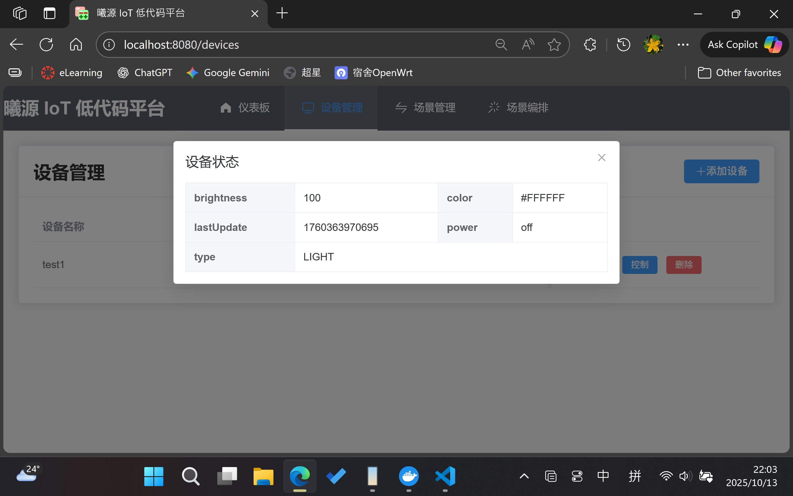
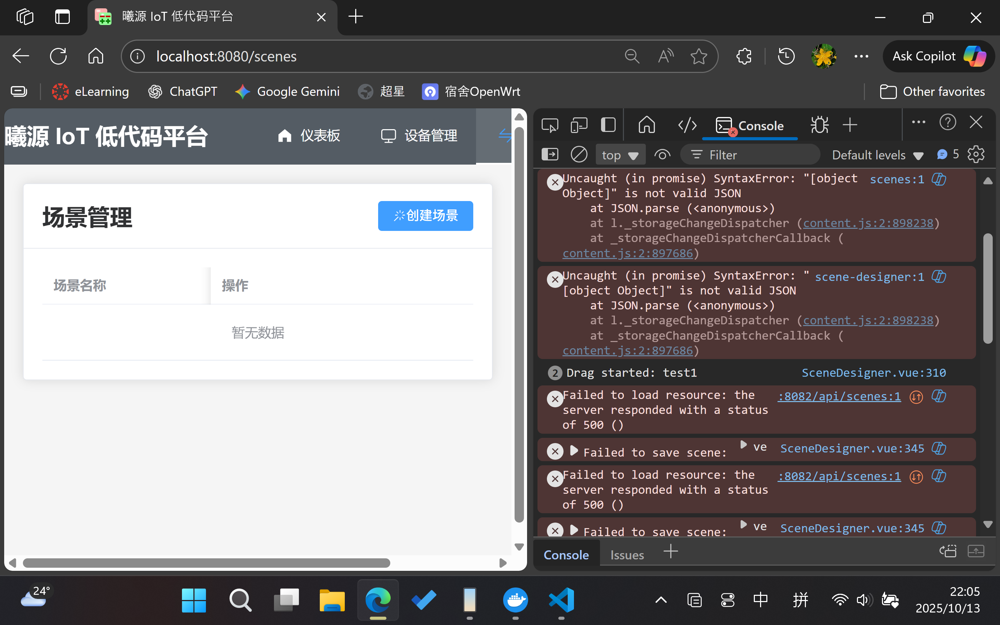
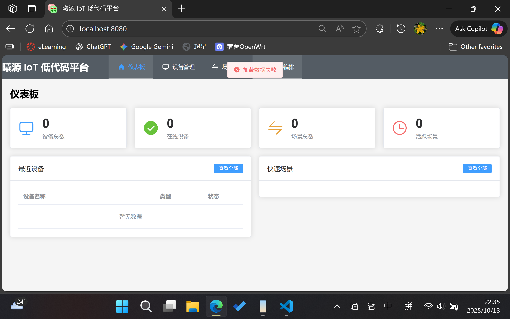

# Problems: 
1. 灯光颜色控制、最后更新时间

2. 无法新建场景（500错误）

3. 场景编排界面增加设备的位置和状态显示
4. 设备名字、位置、房间这些属性在设备创建后需要支持修改
5. 使用docker compose down关闭容器后再启动容器会丢失数据
6. 每次启动容器之后第一次打开网页会提示数据加载失败

# Features:
1. 场景编排界面增加拖动设备编辑的功能