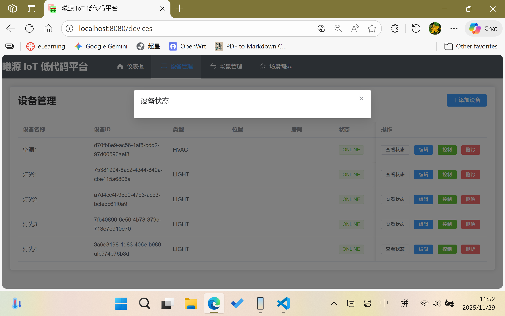
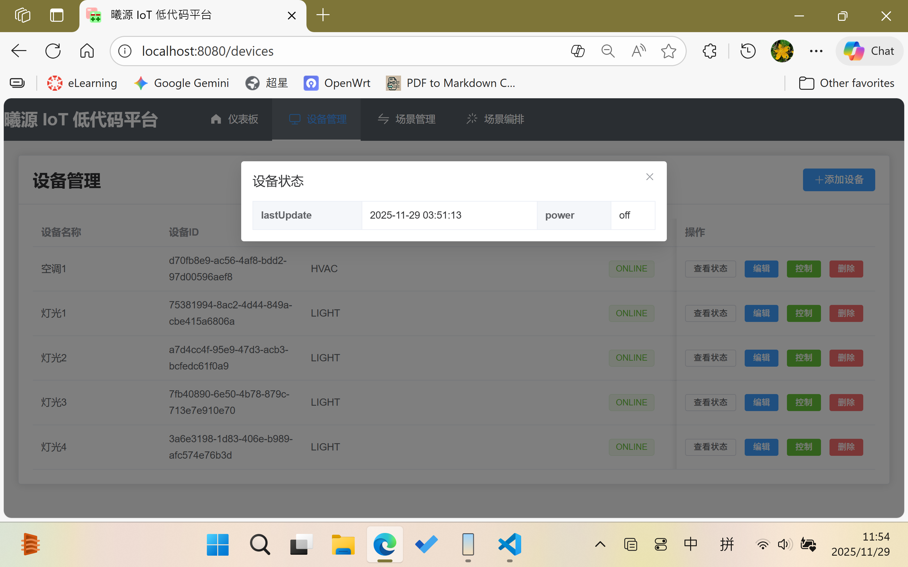
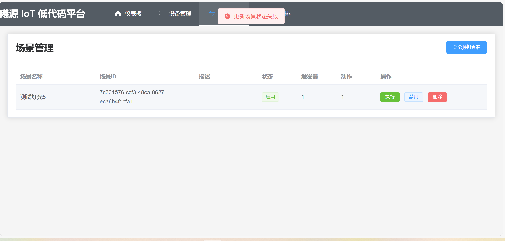

# Problems: 
1. 停止容器重新启动容器之后点击之前已经添加过的设备的“查看状态”按钮，弹出的对话框是空的，没有显示出设备的属性。但是使用“控制”按钮对设备进行了某个属性的修改之后再次点击“查看状态”，就可以显示出这个被修改过的属性及其属性值，但是其他没有被修改过的属性及其属性值还是不会显示出来，直到它被修改过之后。

除此之外，场景只能控制在当前会话中创建的设备而不能控制在当前容器启动之前已经添加的设备（之前添加的设备）。例如，我先运行容器并且创建一个灯的实例，然后关闭容器再重新运行容器，这个时候场景就不能控制这个灯了。具体表现为控制这个灯泡的场景执行成功，但是灯泡的状态没有改变。
2. 设备名字、位置、房间这些属性在设备创建后需要支持修改
3. 禁用场景会报错

4. 场景在创建之后需要支持修改操作
